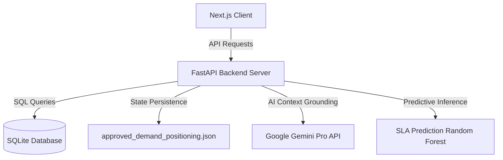

# Sanchar AI OS — Enterprise Logistics Intelligence Platform

Sanchar AI OS is an enterprise-grade logistics command center designed to optimize supply chain flows, predict SLA breaches, detect premium freight cost leaks, and streamline operational decision-making across global logistics hubs.

---

## 1. System Architecture



### Frontend Client
* **Framework**: Next.js 14 (React)
* **Styling**: Tailwind CSS (sleek, light theme, modern enterprise SaaS UI with rounded 18px cards and professional typography)
* **Maps**: Leaflet (interactive geospatial visualization of hubs, repair centers, and corridors)
* **State Management**: Zustand / React Query

### Backend Server
* **Framework**: FastAPI (Python)
* **Server**: Uvicorn
* **ORM**: SQLAlchemy

### Database & Persistence
* **Relational Database**: SQLite (`backend/database/logistics.db`), pre-loaded with normalized transits, parts, hubs, and TPR capacity metrics.
* **Persistent Approvals**: Approvals on the **Demand Positioning** page are written to `backend/database/approved_demand_positioning.json` to ensure user changes persist across page navigation and server restarts.

---

## 2. Key Modules & Features

1. **Mission Control Dashboard**: Live KPI tracking, interactive geospatial maps, current/projected optimization scores, and immediate action-item alert streams.
2. **Operations Explorer & Route Optimizer**: Audits transits, calculates bypass corridors, predicts SLA breach probabilities, and flags anomalies.
3. **AI Demand Positioning**: Identifies cross-city stockouts, evaluates transfer options, calculates savings/transit days saved, and supports one-click, persistent manager approval workflows.
4. **Executive War Room**: Centralized queue for multi-stage approvals with comment history and automation triggers.
5. **AI Copilot**: Slide-over panel offering context-aware recommendations grounded in live database tables.

---

## 3. Installation & Local Development

### Backend Setup
1. Navigate to the backend directory:
   ```bash
   cd backend
   ```
2. Create and activate a Python virtual environment:
   ```bash
   python -m venv venv
   .\venv\Scripts\activate
   ```
3. Install dependencies:
   ```bash
   pip install -r requirements.txt
   ```
4. Start the backend dev server:
   ```bash
   python -m uvicorn backend.main:app --host 127.0.0.1 --port 8000 --reload
   ```

### Frontend Setup
1. Navigate to the frontend directory:
   ```bash
   cd ../frontend
   ```
2. Install packages:
   ```bash
   npm install
   ```
3. Start the Next.js development server:
   ```bash
   npm run dev
   ```
4. Open [http://localhost:3000](http://localhost:3000) in your browser.
