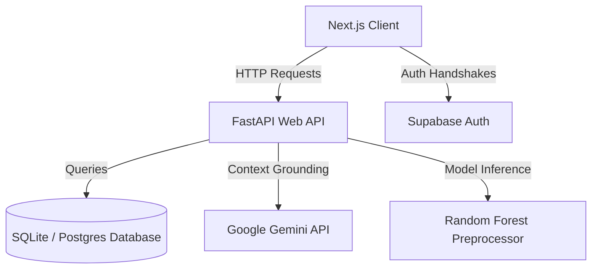

# Sanchar AI OS - Enterprise Technical Documentation

Welcome to the official, enterprise-grade system documentation for the **Sanchar AI OS** (Dell Technologies Logistics Command Platform).

---

## 1. Project Overview

### Project vision
Sanchar AI OS is designed as the next-generation cognitive command tower for global supply chain operations. By combining live spatial digital twins, automated cost-routing recommendation algorithms, and secure collaborative war rooms, Sanchar AI transforms complex dispatch and repair logs into high-value operational decisions.

### Business Problem
Modern supply chains struggle with siloed logistics lanes, slow reaction times to hub congestion, unmonitored air-freight premium leakage, and opaque SLA prediction. Executives need a unified digital tower that validates raw workbook data, calculates optimal carbon/cost bypasses, and automates multi-stage manager sign-off workflows.

### Dell Logistics Challenge Overview
Dell Technologies operates a vast network of logistics hubs and Third-Party Repair (TPR) centers. During disruptions (such as customs delays or stock depletion), dispatchers require an intelligent system to reroute critical spare parts efficiently without introducing unnecessary air-freight costs.

### Solution Overview
Sanchar AI OS integrates:
1. **Mission Control Center**: Real-time KPI wall, interactive Mapbox layouts, and alert streams.
2. **Digital Twin**: Simulated shipment transits with custom playback sliders and What-If offline labs.
3. **Gemini AI Copilot**: Grounded natural language agents answering questions based on active database rows.
4. **Decision Center**: A secure multi-manager workflow queue with comments and audit logs.

### Key Innovations
- **Grounded Tool-Calling Loops**: Gemini is restricted to calling localized SQL query helpers to prevent hallucinations.
- **Dynamic Re-routing Sandbox**: Simulating a hub outage triggers an alternate route calculator comparing cost, speed, and emission footprints.
- **Judge Presentation Mode**: One-click filters to show only critical pitch screens.

---

## 2. System Architecture

### Frontend Client
Built with Next.js 14 and TailwindCSS, utilizing mapbox-gl for spatial visualization and Lucide icons for premium styling. The client persists session states (like collapsed sidebars or Judge Mode switches) in localStorage.

### Backend API
A high-performance FastAPI server running Uvicorn. The backend processes Excel ingestion pipelines, calculates route scores, hosts carbon calculators, and runs tool-calling loops.

### Database Layer
A relational PostgreSQL/SQLite schema storing Hubs, TPR repair metrics, Parts inventory, Transactions, and Audit logs.

### Gemini AI & LangGraph Copilot
Utilizes `gemini-2.5-flash` model. Prompts are constructed dynamically by appending live database facts, enforcing formatted answers containing: Summary, Evidence, Business Impact, Recommendation, and Next Actions.

---

## 3. Tech Stack

| Module | Technology | Usage / Description |
| :--- | :--- | :--- |
| **Frontend Frame** | Next.js 14 | React server components, Turbopack |
| **Backend API** | FastAPI | Async Python REST service |
| **Database** | SQLite / Postgres | Relational data persistence |
| **AI Orchestration**| LangGraph | Cognitive tool-calling pipelines |
| **Maps & Spatial** | mapbox-gl / Leaflet | Animated coordinate shipment tracks |
| **Charts** | Recharts | Features importance & cost trends |
| **Containerization**| Docker | Multi-stage production Dockerfiles |

---

## 4. Complete Phase Documentation

### Phase 1: Enterprise Foundation
- **Objective**: Set up Supabase clients, Next.js structures, and SQLite database migration schemas.
- **Status**: Completed.

### Phase 2: Mission Control
- **Objective**: Ingest the Excel dataset and present overall transits, hub loads, and SLA breach counters.
- **Status**: Completed.

### Phase 3: Route Intelligence
- **Objective**: Develop lanes analysis showing premium costs, transport modes, and delay alerts.
- **Status**: Completed.

### Phase 4: Routing Recommendation Engine
- **Objective**: Implement the scoring algorithm factoring speed, cost, capacity, and SLA risks.
- **Status**: Completed.

### Phase 5: Cost Optimization & Reverse Logistics
- **Objective**: Build the money-leak detector and the TPR repair depot workload analytics dashboard.
- **Status**: Completed.

### Phase 6: SLA Prediction Model Integration
- **Objective**: Build production Random Forest preprocessor and inference endpoints.
- **Status**: Completed.

### Phase 7: Enterprise Platform
- **Objective**: Implement Docker orchestration, Admin permissions, and centralized system health monitoring.
- **Status**: Completed.

### Phase 8: Gemini AI Copilot
- **Objective**: Deploy the slide-over chat assistant utilizing live DB facts.
- **Status**: Completed.

### Phase 9: Digital Twin
- **Objective**: Build animated shipment trackers, carbon footprints (CO₂ emissions), and What-If labs.
- **Status**: Completed.

### Phase 10: Executive War Room
- **Objective**: Build multi-stage manager approval queues and collaboration comment threads.
- **Status**: Completed.

### Phase 11: Production Readiness
- **Objective**: Optimize loading skeletons, secure API middlewares, and add presentation resets.
- **Status**: Completed.

### Phase 12: Executive Demo Experience
- **Objective**: Implement Judge Mode, Pitch Timers, and guided tour scripts.
- **Status**: Completed.

---

## 5. Master Feature Inventory

- [x] **Mission Control**: Live KPI widgets, Mapbox map, filters, and alert stream.
- [x] **AI Copilot**: Slide-over panel, suggested prompt chips, and offline modes.
- [x] **Digital Twin**: Animated coordinate markers, What-If simulation labs, and carbon footprint comparisons.
- [x] **War Room**: Decision approval queue, comments threads, and workflow steps.
- [x] **Reports Center**: Preview and export buttons for PDF, Excel, and CSV.
- [x] **Admin Settings**: System health diagnostics, IAM directories, and Demo resets.

---

## 6. API Documentation

| Endpoint | Method | Purpose |
| :--- | :--- | :--- |
| `/api/v1/health` | `GET` | Health diagnostics test. |
| `/api/v1/twin/network-health` | `GET` | Overall utilization and health score. |
| `/api/v1/twin/shipments` | `GET` | Animatable progress coordinates. |
| `/api/v1/twin/simulate` | `POST` | Triggers hub offline outage re-routing. |
| `/api/v1/twin/carbon` | `GET` | CO₂ metrics calculations. |
| `/api/v1/war-room/dashboard` | `GET` | War-room KPI totals. |
| `/api/v1/war-room/decisions` | `GET` | List of pending decisions. |
| `/api/v1/war-room/decisions/{id}/approve` | `POST` | Advances approval status. |
| `/api/v1/war-room/decisions/{id}/comment` | `POST` | Appends comment note records. |
| `/api/v1/copilot/chat` | `POST` | Grounded Gemini AI conversation parser. |

---

## 7. Remaining Work

The only major remaining task is the final deployment of the **SLA Prediction Model**:
- **Random Forest Model**: Replace the current placeholder SLA prediction stub with the actual `.joblib` model binary when available.
- **Risk Score Explainability**: Feed feature weights (Priority, Origin, Destination) into the prediction card.
